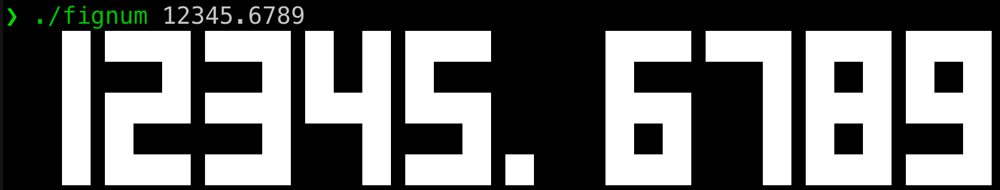

---
# fignum

fignum is a command-line utility written in C that displays sequences of numbers as large, easy-to-read ASCII art, similar to `figlet` but specialized for numerical output. It supports integers and decimal numbers, but not text or other characters.

## Features

* **Numerical Focus:** Designed specifically for rendering numbers as ASCII art.
* **Decimal Support:** Handles numbers with decimal points.
* **Flexible Input:** Accepts input via command-line arguments or standard input.
* **`figlet`-like Output:** Provides large, clear ASCII art representations of numbers.

## Installation

To compile `fignum`, you will need a C compiler (like GCC) and `make`.

1.  **Clone the repository (or download the source code):**
    ```bash
    git clone https://github.com/agtkh/fignum.git
    cd fignum
    ```
2.  **Compile using `make`:**
    ```bash
    make
    ```
    This will create an executable named `fignum` in the current directory.

## Usage

You can use `fignum` by providing numbers as command-line arguments or by piping them through standard input.




### Using Command-Line Arguments

To display numbers directly, pass them as arguments to the `fignum` command:

```bash
./fignum 12345
./fignum 3.14159
./fignum 100 200 300
```

### Using Standard Input

You can also pipe numbers to `fignum`:

```bash
echo "98765" | ./fignum
cat numbers.txt | ./fignum # Assuming numbers.txt contains numbers, one per line
```

---

## Author

K. Agata

## License

This program is licensed under the MIT License. See the `LICENSE` file for more details.
